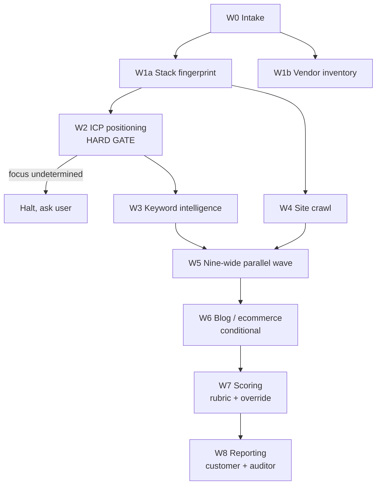

<div align="center">

# Website Auditor by Legion Code Inc.

### Turn a domain into a scored, evidenced, board-ready audit in one run.

[](./LICENSE)
[](./.claude-plugin/plugin.json)
[](#harness-support)
[](#the-bee-army-roster)

Runs a full external website audit end to end: intake through branded reports, across SEO, AEO,
security, accessibility, performance, revenue-funnel UX, analytics, and content, with every score
backed by evidence and nothing scored from a guess.

</div>

<div align="center">

<a href="https://www.ospry.ai">
  <picture>
    <source media="(prefers-color-scheme: dark)" srcset="https://raw.githubusercontent.com/legioncodeinc/brands/main/ospry/logos/png/core-assets/transparent/horizontal-white-1024.png">
    <source media="(prefers-color-scheme: light)" srcset="https://raw.githubusercontent.com/legioncodeinc/brands/main/ospry/logos/png/core-assets/transparent/horizontal-ink-1024.png">
    
  </picture>
</a>

<sub>An audit tells you what's broken. <strong><a href="https://www.ospry.ai">OSPRY</a></strong> is the insight engine that tells you which fix actually moves revenue.</sub>

</div>

---

## What it is

Website Auditor by Legion Code Inc. is a [Hive-architecture](#built-on-the-hive) plugin: a command
(`/perform-website-audit`), a fallback skill for harnesses without native command dispatch
(`master-website-auditor`), and 20 specialized **Bee/Stinger pairs**, each an autonomous agent
(Bee) paired with a deeply researched skill (Stinger). Point it at a domain and it runs the pairs
in dependency-ordered waves, rolls every finding through an N/A-aware weighted rubric, and hands
back a branded XLSX scorecard plus customer- and auditor-facing reports, in Markdown and styled
HTML. One plugin manifest installs it across Claude Code, Cursor, ChatGPT Codex, and Claude Cowork.

## Why it exists

Manual website audits are slow, inconsistent between auditors, and easy to under-evidence: a
finding either lives in someone's head or gets forgotten by the time the report is due. This
plugin encodes a real agency audit process (AEO/SEO, security posture, checkout/funnel UX,
Legion branding) as a repeatable, harness-portable tool. Every checkpoint carries a numeric score,
an evidence pointer, and a one-line justification; nothing gets scored from memory, and nothing
gets penalized for being not applicable.

## Quick start

```bash
# Harnesses with native command dispatch (Claude Code, Cursor, Codex):
/perform-website-audit example.com

# Harnesses without native dispatch, or as an explicit fallback:
# invoke the master-website-auditor skill with the same target domain
```

Either entry point scaffolds a `www.example.com-audit/` workspace, runs the identical 20
Bee/Stinger pairs in the identical dependency-ordered waves, and produces the identical branded
XLSX scorecard plus customer- and auditor-facing reports.

## Install

- A harness with Hive plugin support: Claude Code, Cursor 2.5+, ChatGPT Codex, or Claude Cowork.
- Python 3 with `openpyxl` available, for the scoring engine (`pip install openpyxl`).

```bash
# Claude Code / Cowork
#   drop this repo where the harness reads plugins from (.claude-plugin/plugin.json is the manifest)
# Cursor
#   plugin.json (Agent Plugins) or .cursor-plugin/plugin.json (full Cursor Plugins format)
# Codex
#   .codex-plugin/plugin.json
```

All four manifests are generated from one canonical source
(`.claude-plugin/plugin.json` plus the `agents/`, `skills/`, `commands/` trees) via
`python3 scripts/sync-harnesses.py`. Never hand-edit the generated manifests directly.

## Usage

A full engagement runs nine waves, each gated on the previous one completing:

1. **W0 intake** - four questions, workspace scaffold, no authorization-capture step (the
   customer already has authority over the site being audited).
2. **W1 recon** - stack fingerprint and third-party vendor census, in parallel.
3. **W2 positioning** - ICP, niche, and conversion-goal assessment. **Hard gate:** if the
   site's focus can't be determined, the run halts and asks rather than guessing.
4. **W3 keyword intelligence** - 75-100 keywords, 25-50 questions, sourced through a 4-tier
   fallback chain (Search Console MCP, customer Trends export, AI inference, paid API last resort).
5. **W4 crawl** - platform-aware crawl to depth 100, raw HTML and Markdown per page.
6. **W5 parallel assessment** - nine Bees run genuinely concurrently: technical SEO, AEO,
   content semantics, internal linking, accessibility, security posture, analytics, performance,
   and visual funnel, plus social presence independently.
7. **W6 conditional** - blog content and ecommerce catalog audits, only if detected.
8. **W7 scoring** - every finding rolled up through the weighted rubric into a single grade.
9. **W8 reporting** - customer and auditor reports rendered from the scored workbook.

## The Bee Army roster

| Wave | Bee | Stinger's job |
|---|---|---|
| W0 | `audit-intake-worker-bee` | Six-step intake, workspace scaffold, template hydration |
| W1 | `stack-fingerprint-worker-bee` | Tech stack and render-mode detection from the landing page |
| W1 | `vendor-inventory-worker-bee` | Full third-party vendor and script census |
| W2 | `icp-positioning-worker-bee` | ICP/niche/goal assessment, conversion taxonomy, hard-stop gate |
| W3 | `keyword-intelligence-worker-bee` | Keyword and question targets, 4-tier source priority |
| W4 | `site-crawler-worker-bee` | Platform-aware crawl to depth 100 |
| W5 | `technical-seo-worker-bee` | Crawlability, sitemap, robots.txt, canonicalization, deep linking |
| W5 | `aeo-audit-worker-bee` | llms.txt, AI-crawler access, citation-relevant structured data |
| W5 | `content-semantics-worker-bee` | Reading level, ICP relevancy of on-page copy |
| W5 | `internal-linking-worker-bee` | Orphan pages, click depth, anchor text, link-equity flow |
| W5 | `accessibility-audit-worker-bee` | WCAG 2.1 AA, scored 0-100% with an AA/AAA-style band |
| W5 | `web-security-posture-worker-bee` | External passive security posture, highest-weighted category |
| W5 | `analytics-stack-worker-bee` | Foundational, industry, and lawful de-anonymization analytics |
| W5 | `performance-cwv-worker-bee` | CDN, caching strategy, Core Web Vitals |
| W5 | `visual-funnel-worker-bee` | Desktop and mobile funnel walk with screenshots at every step |
| W5 | `social-presence-worker-bee` | Facebook/LinkedIn/Instagram, opt-in auth, silent no-op on decline |
| W6 | `blog-content-worker-bee` | Recent posts, word count, AI-authorship as a probability band |
| W6 | `ecommerce-catalog-worker-bee` | Product metadata completeness and conversion-copy quality |
| W7 | `audit-scoring-worker-bee` | N/A-aware weighted rollup, critical-security-override, XLSX |
| W8 | `audit-reporting-worker-bee` | Branded customer and auditor reports, Markdown and HTML |

Every Bee pairs with exactly one Stinger (its skill); load the Stinger's `SKILL.md` before trusting
anything the Bee does. Full detail per pair: `skills/<slug>-stinger/SKILL.md`.

## Scoring architecture



Every leaf checkpoint scores 0-6 (0 is N/A, excluded from both numerator and denominator, and
never counts as a failure); scores roll up leaf &rarr; sub-audit &rarr; category &rarr; final
through N/A-aware masked-SUMPRODUCT formulas at every level.

| Rank | Category | Weight |
|---:|---|---:|
| 1 | Security | 20% |
| 2 | Revenue drivers | 18% |
| 3 | Mission critical | 14% |
| 4 | Analytics and insight | 12% |
| 5 | Technical deployment | 11% |
| 6 | Foundational completeness | 10% |
| 7 | Search presence | 9% |
| 8 | Content score | 6% |

A single critical-security finding (any Security leaf scored 1) caps the final grade at C
regardless of every other score. Category weights live in the scored workbook's `Rubric` sheet as
named ranges, retunable per engagement without touching a single formula.

## Deliverables

- **`scoring/audit-scorecard.xlsx`** - 16 sheets, 20 named ranges, N/A-aware rollups at
  every level, the critical-security-override, and a Legion Code Inc. footer. Template:
  `skills/audit-scoring-stinger/references/templates/website-audit-scorecard-template.xlsx`.
- **Customer report** - executive-summary-first, plain-language, Markdown and styled HTML.
- **Auditor report** - full technical detail, every finding with evidence and justification,
  plus the verification log of discarded or reframed candidate findings.

Both report pairs render from the same brand config
(`skills/audit-reporting-stinger/references/templates/brand.json`); the Legion Code Inc. credit
line and mark appear exactly once, in the footer, per the brand system's scarcity rule.

## Harness support

| Harness | Entry point | Notes |
|---|---|---|
| Claude Code | `/perform-website-audit` | Native command and parallel agent dispatch |
| Cursor 2.5+ | `/perform-website-audit` | Same command surface, Agent Plugins manifest |
| ChatGPT Codex | `master-website-auditor` skill | Codex has no documented parallel-subagent file format; Wave 5 runs sequentially |
| Claude Cowork | `commands/perform-website-audit.md` | Flat command path preferred over `skills/` pending a known Cowork slash-invocation bug |

## Configuration

This plugin has no required environment variables of its own; it is markdown Bees/Stingers plus a
handful of stdlib-only Python scripts. The one optional integration point is a **Google Search
Console MCP server**, if the operator has one connected: `keyword-intelligence-worker-bee` uses it
as tier 1 of its keyword-source priority chain and degrades gracefully through the fallback chain
when it isn't present. `.env.example` documents the generic scaffold convention this repo inherited
from `get-started-stinger`; it is not yet filled in with plugin-specific keys.

## Architecture

Built with [`queen-bee-stinger`](https://github.com/legioncodeinc)'s seven-stage forge pipeline:
Topic, Research, Distillation, References, Guides, final Skill/Bee authorship, and Register. Every
factual claim in a Stinger's procedure traces to a primary source archived under
`skills/<slug>-stinger/references/research/raw/`, cited inline; where the research is silent, the
gap is flagged in the file rather than smoothed over. See
`library/requirements/reports/step7-handoff-report.md` for the full build history.

## Development

```bash
git clone <this repo>
cd website-auditor-by-legion-code-inc
python3 scripts/sync-harnesses.py --check   # verify no drift across the four generated manifests
```

Read `library/README.md` to orient in the documentation tree: PRDs under
`library/requirements/backlog/`, build reports under `library/requirements/reports/`. See
[CONTRIBUTING.md](./CONTRIBUTING.md) for the full workflow.

## Testing

```bash
python3 scripts/sync-harnesses.py --check   # frontmatter, dash-guard, drift
python3 -c "import openpyxl; openpyxl.load_workbook('skills/audit-scoring-stinger/references/templates/website-audit-scorecard-template.xlsx')"
python3 skills/audit-reporting-stinger/references/scripts/render-report.py
```

No end-to-end automated test suite exists yet for a live audit run; each Bee/Stinger pair's
deterministic scripts are individually smoke-tested (see their own `references/scripts/`).

## Deployment

Forge stages 1 through 6 are complete for all 20 Bee/Stinger pairs and both orchestration
components. Stage 7 (register into `beekeeper-suit`, deploy, cross-repo reference sync) has not
run yet, and the Ship Gate (`security-stinger` &rarr; `quality-stinger` &rarr;
`github-repo-health-stinger`) has not run. Nothing here should be treated as ship-ready until both
complete and a human has reviewed the reports.

## Contributing

See [CONTRIBUTING.md](./CONTRIBUTING.md) for branching, commit conventions, and how to run the
verification steps above before opening a PR. Every Bee/Stinger pair change should re-run
`scripts/sync-harnesses.py --check` before commit.

## License

Website Auditor by Legion Code Inc. is free software: you can redistribute it and/or modify it
under the terms of the **GNU Affero General Public License, version 3** (AGPLv3). See
[LICENSE](./LICENSE) for the full text. Because this tool interacts with users remotely over a
network, anyone who modifies it and offers it to others over a network must also offer those users
the Corresponding Source, per AGPLv3 section 13.

---

<div align="center">

<picture>
  <source media="(prefers-color-scheme: dark)" srcset="https://raw.githubusercontent.com/legioncodeinc/brands/main/legion-code-inc/logos/legion-symbol-dark.svg">
  <source media="(prefers-color-scheme: light)" srcset="https://raw.githubusercontent.com/legioncodeinc/brands/main/legion-code-inc/logos/legion-symbol-light.svg">
  
</picture>

<sub>Audit tool created by <strong>Legion Code Inc.</strong> &middot; <a href="mailto:mario@legioncodeinc.com">mario@legioncodeinc.com</a></sub>

<sub><strong>We are Legion. Vibe with Legion.</strong></sub>

</div>
